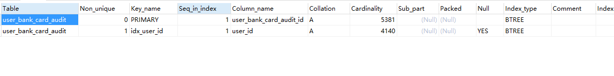

# 数据库的四个特性：

## 1.原子性

 * 事物包含的所有操作要么全部成功，要么全部失败回滚。

## 2.一致性

 * 事物必须使数据库从一个一致性状态变到另一个一致性状态，也就是说一个事物执行之前和执行之后都必须处于一致性状态。
 
## 3.隔离性
 
 * 多个用户并发访问数据库时，比如操作同一张表、数据库为每个用户开启一个事物，不能被其他事物操作所干扰。多个并发事物之间相互隔离。
 
## 4.持久性

 *  一个事物一旦提交，数据库中的数据改变是永久性的。
# 数据库连接池
- 数据库连接池负责分配、管理和释放数据库连接。他运行应用程序重复使用一个现有的连接。而不是重新再建立一个。释放空闲时间超过最大空闲时间的数据库连接来避免因为没有释放数据库连接而引起的数据库连接泄露。
 # 数据库索引

 - 1．索引作用

    - 在索引列上，除了上面提到的有序查找之外，数据库利用各种各样的快速定位技术，能够大大提高查询效率。特别是当数据量非常大，查询涉及多个表时，使用索引往往能使查询速度加快成千上万倍。

    - 比如，有3个未索引的表t1、t2、t3，分别只包含列c1、c2、c3，每个表分别含有1000行数据组成，指为1～1000的数值，查找对应值相等行的查询如下所示。
    
  

         SELECT c1,c2,c3 FROM t1,t2,t3 WHERE c1=c2 AND c1=c3  

    
  

    - 此查询结果应该为1000行，每行包含3个相等的值。在无索引的情况下处理此查询，必须寻找3个表所有的组合，以便得出与WHERE子句相配的那些行。而可能的组合数目为1000×1000×1000（十亿），显然查询将会非常慢。

    -  如果对每个表进行索引，就能极大地加速查询进程。利用索引的查询处理如下。

        - （1）从表t1中选择第一行，查看此行所包含的数据。

        - （2）使用表t2上的索引，直接定位t2中与t1的值匹配的行。类似，利用表t3上的索引，直接定位t3中与来自t1的值匹配的行。

         - （3）扫描表t1的下一行并重复前面的过程，直到遍历t1中所有的行。

        在此情形下，仍然对表t1执行了一个完全扫描，但能够在表t2和t3上进行索引查找直接取出这些表中的行，比未用索引时要快一百万倍。

        利用索引，MySQL加速了WHERE子句满足条件行的搜索，而在多表连接查询时，在执行连接时加快了与其他表中的行匹配的速度。

- 2.创建索引

    在执行CREATE TABLE语句时可以创建索引，也可以单独用CREATE INDEX或ALTER TABLE来为表增加索引。

    - (1)．ALTER TABLE

        ALTER TABLE用来创建普通索引、UNIQUE索引或PRIMARY KEY索引。
        
  

            ALTER TABLE table_name ADD INDEX index_name (columns)

            ALTER TABLE table_name ADD UNIQUE (columns)

            ALTER TABLE table_name ADD PRIMARY KEY (columns)  

        
 

        其中table_name是要增加索引的表名，columns指出对哪些列进行索引，多列时各列之间用逗号分隔。索引名index_name可选，缺省时，MySQL将根据第一个索引列赋一个名称。另外，ALTER TABLE允许在单个语句中更改多个表，因此可以在同时创建多个索引。

    - (2)．CREATE INDEX
        
  

            CREATE INDEX index_name ON table_name (column_list)

            CREATE UNIQUE INDEX index_name ON table_name (column_list) 
        

        可对表增加普通索引或UNIQUE索引。table_name、index_name和column_list具有与ALTER TABLE语句中相同的含义，索引名不可选。另外，不能用CREATE INDEX语句创建PRIMARY KEY索引。

- 3．索引类型

   - 在创建索引时，可以规定索引能否包含重复值。如果不包含，则索引应该创建为PRIMARY KEY或UNIQUE索引。对于单列惟一性索引，这保证单列不包含重复的值。对于多列惟一性索引，保证多个值的组合不重复。

   -  PRIMARY KEY索引和UNIQUE索引非常类似。事实上，PRIMARY KEY索引仅是一个具有名称PRIMARY的UNIQUE索引。这表示一个表只能包含一个PRIMARY KEY，因为一个表中不可能具有两个同名的索引。

   - 下面的SQL语句对students表在sid上添加PRIMARY KEY索引。    

        
  

            ALTER TABLE students ADD PRIMARY KEY   (sid)  

        

- 4.删除索引

    - 可利用ALTER TABLE或DROP INDEX语句来删除索引。类似于CREATE INDEX语句，DROP INDEX可以在ALTER TABLE内部作为一条语句处理，语法如下。
    
 

        DROP INDEX index_name ON talbe_name 

        ALTER TABLE table_name DROP INDEX  
          index_name

        ALTER TABLE table_name DROP PRIMARY KEY  

    

    其中，前两条语句是等价的，删除掉table_name中的索引index_name。

    第3条语句只在删除PRIMARY KEY索引时使用，因为一个表只可能有一个PRIMARY KEY索引，因此不需要指定索引名。如果没有创建PRIMARY KEY索引，但表具有一个或多个UNIQUE索引，则MySQL将删除第一个UNIQUE索引。

    如果从表中删除了某列，则索引会受到影响。对于多列组合的索引，如果删除其中的某列，则该列也会从索引中删除。如果删除组成索引的所有列，则整个索引将被删除。

- 5．查看索引

    
  

        mysql> show index from tbname;

        mysql> show keys from tbname;
    
  
    eg: 
    
    

    -  Table

         表的名称。

    - Non_unique
    
         如果索引不能包括重复词，则为0。如果可以，则为1。

    - Key_name

        索引的名称。

    - Seq_in_index

        索引中的列序列号，从1开始。

    - Column_name

         列名称。

    - Collation

         列以什么方式存储在索引中。在MySQL中，有值‘A’（升序）或NULL（无分类）。

    - Cardinality

        索引中唯一值的数目的估计值。通过运行ANALYZE TABLE或myisamchk -a可以更新。基数根据被存储为整数的统计数据来计数，所以即使对于小型表，该值也没有必要是精确的。基数越大，当进行联合时，MySQL使用该索引的机会就越大。

    - Sub_part

        如果列只是被部分地编入索引，则为被编入索引的字符的数目。如果整列被编入索引，则为NULL。

    - Packed

        指示关键字如何被压缩。如果没有被压缩，则为NULL。

    - Null

         如果列含有NULL，则含有YES。如果没有，则该列含有NO。

    - Index_type

      用过的索引方法（BTREE, FULLTEXT, HASH, RTREE）。

# 搜索引擎

-  Mysql中 MyISAM和InnoDB 的区别
    
    - InnoDB支持事务，MyISAM不支持。对于InnoDB每一条sql语言都默认封装成事物，这样会影响速度。所以最好把多条sql语言放在begin和commit之间，组成一个事物。
    - InnoDB支持外键，MyISAM不支持。对于包含InnoDB的表转为MyISAM会失败
    - InnoDB是聚集索引,数据文件和索引绑在一起的。必须要有主键，主键效率很高。但是辅助索引需要查询两次，先查询到主键,再通过主键查询到
    据文件分离的。索引保存的是数据文件的指针.主索引和辅助索引独立。
    - InnoDB不保存表的具体行,执行select count(*)from table需要全表扫描。而MyISAM用一个变量保存了具体行数。执行sql时只要读出该变量即可,速度很快。
    - InnoDB不支持全文索引,而MyISAM支持全文索引,查询效率上MyISAM要高。

- 如何选择MyISAM和InnoDB

    - 是否要支持事物，如果要选InnoDB,不需要的话考虑MyISAM
    - 如果绝大多数是只读查询,考虑MyISAM.读写频繁使用InnoDB
    - 系统奔溃后，MyISAM恢复起来更困难，能否接受；

    - MySQL5.5版本开始Innodb已经成为Mysql的默认引擎(之前是MyISAM)，说明其优势是有目共睹的，如果你不知道用什么，那就用InnoDB，至少不会差。
# 隔离级别
- sql四个隔离级别:
    
    - read uncommited :读到未提交的数据

        - 该隔离级别，所有事物都可以看到其他未提交事物的执行结果。很少用，也称为脏读。

    - read commited :读取提交内容

        - 一个事物只能看见已经提交事物做出的改变.

    - repeatable read :可重复读
        
        - mysql默认级别。确保同一事物的多个实例在并发读取数据时,会看到同样的数据行.可能会导致幻读。幻读是指当用户读取某一范围的数据行时,另一事物又在该范围内插入了新行。当用户再读取数据行时会发现新的幻影行.InnoDB存储引擎通过并发控制即间隙锁解决了这个问题。

    - serializable:串行事物
        
        - 隔离最高级别。通过强制事物排序,使之不可能相互冲突,解决幻读问题。他是在每个数据行上加上共享锁。这个级别可能导致大量的超时和锁竞争。

- 隔离级别现象:

    - 脏读：

        一个事物可以读取另一个未提交事物的修改数据。
    - 非重复读：
        同一个事物中，同一查询在T1时间读取某一行，T2时间重新读取这一行数据已经发生修改,可能被更新了，也可能被删除了。
    - 幻象读：同一个事物中，同一查询多次的时候.由于其他插入操作事物的提交.不同隔离级别有不同的现象。隔离级别越高并发性越差

<table>  
    <tr>  
        <th><td bgcolor= BlueViolet><b>隔离级别</b></td>  
        <th><td bgcolor= BlueViolet><b>脏读</b></td></th>  
        <th><td bgcolor= BlueViolet><b>非重复读</b></td></th>
        <th><td bgcolor= BlueViolet><b>幻读</b></td></th>  
    </tr>    
    <tr>  
        <th><td bgcolor= BlueViolet>readuncommited</td></th>   
        <th><td bgcolor= BlueViolet>允许</td></th>  
        <th><td bgcolor= BlueViolet>允许</td></th>
        <th><td bgcolor= BlueViolet>允许</td></th>  
    </tr>
    <tr>  
        <th><td bgcolor= BlueViolet>read commited</td></th>    
        <th><td bgcolor= BlueViolet></td></th>  
        <th><td bgcolor= BlueViolet>允许</td></th>
        <th><td bgcolor= BlueViolet>允许</td></th>  
    </tr> 
    <tr>  
        <th><td bgcolor= BlueViolet>repeatable read</td></th>    
        <th><td bgcolor= BlueViolet></td></th>  
        <th><td bgcolor= BlueViolet></td></th>
        <th><td bgcolor= BlueViolet>允许</td></th>  
    </tr>     
    <tr>  
        <th><td bgcolor= BlueViolet>serializable</td></th>    
        <th><td bgcolor= BlueViolet></td></th>  
        <th><td bgcolor= BlueViolet></td></th>
        <th><td bgcolor= BlueViolet></td></th>  
    </tr>   
</table>

# 乐观锁和悲观锁

## 乐观锁
    
- 总是假设最好的情况，每次去拿数据的时候都认为别人不会修改，所以不会上锁，但是在更新的时候会判断一下在此期间别人有没有去更新这个数据，可以使用版本号机制和CAS算法实现。乐观锁适用于多读的应用类型，这样可以提高吞吐量.

## 悲观锁

- 总是假设最坏的情况，每次去拿数据的时候都认为别人会修改，所以每次在拿数据的时候都会上锁，这样别人想拿这个数据就会阻塞直到它拿到锁（共享资源每次只给一个线程使用，其它线程阻塞，用完后再把资源转让给其它线程）。传统的关系型数据库里边就用到了很多这种锁机制，比如行锁，表锁等，读锁，写锁等，都是在做操作之前先上锁。

    - 在一般查询sql中，是这样的写查询：

    - 1.select * from table where id=1;
    此时并没有提交该事务1

    这样做是无法起到上锁的目的，也就是说其他事务中可能有

    - 2.update table set name='wind' where id=1;

    事务2如上文修改了数据，并commit 
    此时事务1执行下一句

    - 3.select * from table where id=1;

    发现会发现name字段2次结果不一致，这就是数据库事务并发时可能发生的不可重复读情况

    解决方法是

    select * from table where id=1 LOCK IN SHARE MODE;

- *注：共享锁（S）：允许一个事务去读一行，阻止其他事务获得相同数据集的排他锁。 
排他锁（X)：允许获得排他锁的事务更新数据，阻止其他事务取得相同数据集的共享读锁和排他写锁。*

